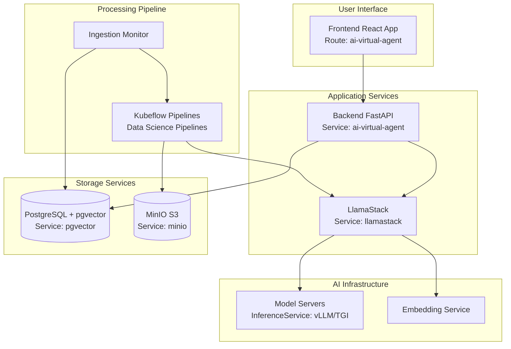

<!-- omit from toc -->
# Installing AI Virtual Agent Quickstart

The AI Virtual Agent Quickstart is designed for production deployment on OpenShift AI and compatible Kubernetes platforms. This guide covers installation, configuration, and production operations.

<!-- omit from toc -->
## Table of Contents
- [Architecture](#architecture)
- [Prerequisites](#prerequisites)
  - [Hardware Requirements](#hardware-requirements)
  - [Supported Models](#supported-models)
  - [Required Software](#required-software)
  - [Required Access](#required-access)
- [Installation](#installation)
  - [1. Prepare the Environment](#1-prepare-the-environment)
  - [2. Identify GPU Node Configuration](#2-identify-gpu-node-configuration)
  - [3. Review Available Models](#3-review-available-models)
  - [4. Configure API Keys](#4-configure-api-keys)
  - [5. Install the Application](#5-install-the-application)
    - [Basic Installation (No Safety Shields)](#basic-installation-no-safety-shields)
    - [Production Installation (With Safety Shields)](#production-installation-with-safety-shields)
    - [Simplified Installation (Untainted Nodes)](#simplified-installation-untainted-nodes)
    - [Installation with pre-installed models](#installation-with-pre-installed-models)
- [Check Installation Status](#check-installation-status)
- [Access the Application](#access-the-application)
- [Troubleshooting](#troubleshooting)
- [Uninstallation](#uninstallation)


## Architecture



## Prerequisites

### Hardware Requirements

- **1 GPU with 24GB+ VRAM** for the primary LLM model
- **1 GPU with 24GB+ VRAM** for the safety/shield model (optional)

### Supported Models

| Function    | Model Name                             | GPU Required    | AWS Instance
|-------------|----------------------------------------|-----------------|-------------
| Embedding   | `all-MiniLM-L6-v2`                     | CPU or GPU      | -
| Generation  | `meta-llama/Llama-3.2-3B-Instruct`     | L4 (24GB)       | g6.2xlarge
| Generation  | `meta-llama/Llama-3.1-8B-Instruct`     | L4 (24GB)       | g6.2xlarge
| Generation  | `meta-llama/Meta-Llama-3-70B-Instruct` | A100 x2 (80GB)  | p4d.24xlarge
| Safety      | `meta-llama/Llama-Guard-3-8B`          | L4 (24GB)       | g6.2xlarge

### Required Software

- **OpenShift Cluster 4.16+** with OpenShift AI 2.19+
- **OpenShift Client CLI** - [oc](https://docs.redhat.com/en/documentation/openshift_container_platform/4.18/html/cli_tools/openshift-cli-oc#installing-openshift-cli)
- **Helm CLI** - [helm](https://helm.sh/docs/intro/install/)
- **[Hugging Face CLI](https://huggingface.co/docs/huggingface_hub/guides/cli)** (optional)
- **[Hugging Face Token](https://huggingface.co/settings/tokens)** with access to Meta Llama models
- **[Tavily API Key](https://tavily.com/)** for web search capabilities

### Required Access

- Access to [Meta Llama](https://huggingface.co/meta-llama/Llama-3.2-3B-Instruct/) models
- Access to [Meta Llama Guard](https://huggingface.co/meta-llama/Llama-Guard-3-8B/) models (optional)
- OpenShift cluster admin or sufficient permissions for:
  - Creating namespaces
  - Deploying workloads with GPU resources
  - Creating persistent volume claims
  - Managing secrets and config maps

## Installation

### 1. Prepare the Environment

Clone the repository:
```bash
git clone https://github.com/rh-ai-quickstart/ai-virtual-agent
cd ai-virtual-agent
```

Login to your OpenShift cluster:
```bash
oc login --server="<cluster-api-endpoint>" --token="sha256~XYZ"
```

### 2. Identify GPU Node Configuration

If GPU nodes are tainted, identify the taint key for deployment configuration:

```bash
oc get nodes -l nvidia.com/gpu.present=true -o yaml | grep -A 3 taint
```

Example output:
```yaml
taints:
- effect: NoSchedule
  key: nvidia.com/gpu
  value: "true"
```

Work with your cluster admin team to determine the appropriate labels and taints for GPU-enabled nodes.

### 3. Review Available Models

List available models:
```bash
make list-models
```

Example output:
```
model: llama-3-1-8b-instruct (meta-llama/Llama-3.1-8B-Instruct)
model: llama-3-2-1b-instruct (meta-llama/Llama-3.2-1B-Instruct)
model: llama-3-2-1b-instruct-quantized (RedHatAI/Llama-3.2-1B-Instruct-quantized.w8a8)
model: llama-3-2-3b-instruct (meta-llama/Llama-3.2-3B-Instruct)
model: llama-3-3-70b-instruct (meta-llama/Llama-3.3-70B-Instruct)
model: llama-guard-3-1b (meta-llama/Llama-Guard-3-1B)
model: llama-guard-3-8b (meta-llama/Llama-Guard-3-8B)
```

### 4. Configure API Keys

To enable enhanced web search capabilities, you can configure your Tavily API key:

1. **Get a Tavily API Key**: Sign up at [Tavily](https://tavily.com/) and obtain your API key

2. **During installation**: The installer will prompt you to enter your Tavily API key
   - Enter your key when prompted to enable web search capabilities
   - Press Enter (leave blank) to skip and proceed without web search functionality

3. **Alternative - Set as environment variable** (for automation/scripting):
   ```bash
   export TAVILY_API_KEY="your-tavily-api-key"
   ```
   This will skip the interactive prompt during installation.

**Notes**:
- The application will function without the Tavily key, but web search capabilities will be disabled
- Setting the environment variable locally only affects the installation process - the key gets deployed to your cluster during installation

### 5. Install the Application

#### Basic Installation (No Safety Shields)

```bash
make install \
  NAMESPACE=ai-virtual-agent \
  LLM=llama-3-1-8b-instruct \
  LLM_TOLERATION="nvidia.com/gpu"
```

#### Production Installation (With Safety Shields)

```bash
make install \
  NAMESPACE=ai-virtual-agent \
  LLM=llama-3-1-8b-instruct \
  LLM_TOLERATION="nvidia.com/gpu" \
  SAFETY=llama-guard-3-8b \
  SAFETY_TOLERATION="nvidia.com/gpu"
```

#### Simplified Installation (Untainted Nodes)

If all worker nodes have GPUs and are not tainted:
```bash
make install \
  NAMESPACE=ai-virtual-agent \
  LLM=llama-3-1-8b-instruct \
  SAFETY=llama-guard-3-8b
```

#### Installation with pre-installed models
```bash
make install \
NAMESPACE=ai-virtual-agent \
LLM=llama-3-1-8b-instruct \
LLM_URL= <your-llm-url>\
SAFETY=llama-guard-3-8b \
SAFETY_URL= <your-safety-model-url>
```

When prompted, enter your **[Hugging Face Token](https://huggingface.co/settings/tokens)** and your **[Tavily API Key](https://tavily.com/)** for enhanced web search capabilities.

  **Note**:
  - The Tavily API Key enables advanced web search functionality in your AI agents
  - Installation may take 10-30 minutes depending on model sizes and download speeds

## Check Installation Status

Monitor the installation progress and verify when components are ready:

```bash
make install-status NAMESPACE=ai-virtual-agent
```

Wait for all pods to show `Running` status before proceeding to access the application.

## Access the Application

The installation will automatically display the application URL when complete. Open the URL in your browser to access the AI Virtual Agent interface.

If you need to retrieve the URL later:

```bash
oc get routes ai-virtual-agent -n ai-virtual-agent
```

## Troubleshooting

If installation fails or the application isn't accessible, use the status command to identify issues:

```bash
make install-status NAMESPACE=ai-virtual-agent
```

This will show detailed information about pods, services, and other resources.

## Uninstallation

Remove the application and all associated resources:

```bash
make uninstall NAMESPACE=ai-virtual-agent
```

This will automatically clean up:
- Helm chart and all deployed resources
- Persistent Volume Claims (PVCs) for pgvector and MinIO
- Remaining pods in the namespace

To completely remove the namespace:

```bash
oc delete project ai-virtual-agent
```
