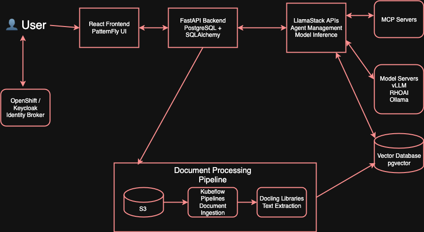

# AI Virtual Agent Quickstart

A platform for creating and managing AI-powered virtual agents with knowledge base integration, built on top of LlamaStack.

## What is this?

This platform provides the tools to build and deploy conversational AI agents that can:

- **Access knowledge bases** - Upload documents and create searchable knowledge bases for RAG (Retrieval-Augmented Generation)
- **Use tools** - Integrate web search, databases, and custom tools through the Model Context Protocol (MCP)
- **Apply guardrails** - Built-in safety measures and content filtering
- **Scale in production** - Kubernetes-ready architecture

### Key Features

🤖 **Agent Management** - Create and configure AI agents with different capabilities
📚 **Knowledge Integration** - Document search and question answering via RAG
💬 **Real-time Chat** - Streaming conversations with session history
🔧 **Tool Ecosystem** - Built-in tools plus extensible MCP server support
🛡️ **Safety Controls** - Configurable guardrails and content filtering

## Quick Start

### Local Development

For local containerized development (without cluster):

📖 **[→ See Local Development Guide](DEVELOPMENT.md)**

### Installation

**Option 1: One-command setup**
```bash
git clone https://github.com/rh-ai-quickstart/ai-virtual-agent
cd ai-virtual-agent
make install dev
```

**Option 2: Step-by-step**
```bash
# 1. Start database (automatically initializes with permissions)
podman compose up -d
# or with Docker:
# docker-compose up -d

# 2. Start backend
cd backend && python -m venv venv && source venv/bin/activate
pip install -r requirements.txt && alembic upgrade head
uvicorn main:app --reload &

# 3. Start frontend
cd ../frontend && npm install && npm run dev
```

> **Note**: The PostgreSQL database is automatically initialized with proper permissions. Works with both Docker and Podman. No manual database setup needed!

**Access your app:**
- Frontend: http://localhost:5173
- API: http://localhost:8000
- Docs: http://localhost:8000/docs

### Production Deployment

For production installation on Kubernetes/OpenShift:

```bash
make install NAMESPACE=ai-virtual-agent
```

📖 **[Full Installation Guide →](INSTALLING.md)**

## Project Structure

```
ai-virtual-agent/
├── frontend/           # React UI with PatternFly components
├── backend/            # FastAPI server with PostgreSQL
├── mcpservers/         # Custom MCP tool servers
├── docs/               # Architecture and API documentation
├── helm/               # Kubernetes and Helm deployment
├── scripts/            # Development and deployment scripts
└── tests/              # Integration test suite
```

## Architecture Overview

The platform integrates several components:

- **React Frontend** - Web interface for agent and chat management
- **FastAPI Backend** - API server handling business logic and data persistence
- **LlamaStack** - AI platform managing models, agents, and inference
- **PostgreSQL + pgvector** - Data storage with vector search capabilities
- **Kubernetes Pipeline** - Document processing and knowledge base ingestion



📖 **[Detailed Architecture →](docs/virtual-agents-architecture.md)**

## Getting Started Guides

### 👩‍💻 **For Developers**
- **[Local Development Guide](DEVELOPMENT.md)** - Containerized development environment (without cluster)
- **[Contributing Guide](CONTRIBUTING.md)** - Development setup and workflow
- **[Backend API Reference](docs/api-reference.md)** - Complete API documentation
- **[Frontend Architecture](frontend/README.md)** - UI components and patterns

### 🚀 **For Deployment**
- **[Installation Guide](INSTALLING.md)** - Production deployment on Kubernetes
- **[Agent Templates](docs/agent-templates-ingestion.md)** - Pre-built agent configurations
- **[Knowledge Base Setup](docs/knowledge-base-architecture.md)** - Document processing pipeline

### 🔧 **For Integration**
- **[MCP Servers](mcpservers/README.md)** - Building custom tool integrations
- **[Testing Guide](tests/README.md)** - Running integration tests
- **[API Reference](docs/api-reference.md)** - Backend API endpoints

## Example Use Cases

**Customer Support Agent**
```typescript
const agent = await createAgent({
  name: "Support Bot",
  model: "llama3.1-8b-instruct",
  knowledge_bases: ["support-docs"],
  tools: ["builtin::rag", "builtin::web_search"]
});
```

**Domain Expert (Banking)**
```typescript
const expert = await initializeAgentTemplate({
  template: "commercial_banker",
  knowledge_bases: ["banking-regulations"]
});
```

## Development Commands

```bash
# Start everything locally
make dev

# Run tests
make test

# Stop all services
make stop

# Reset database
make reset-db
```

## Community & Support

- **🐛 Issues** - [Report bugs and request features](https://github.com/rh-ai-quickstart/ai-virtual-agent/issues)
- **💬 Discussions** - [Ask questions and share ideas](https://github.com/rh-ai-quickstart/ai-virtual-agent/discussions)
- **🤝 Contributing** - See [CONTRIBUTING.md](CONTRIBUTING.md) for guidelines
- **📚 Documentation** - Browse `/docs` for detailed guides

## License

[MIT License](LICENSE) - Built with ❤️ by the Red Hat Ecosystem App Engineering team
