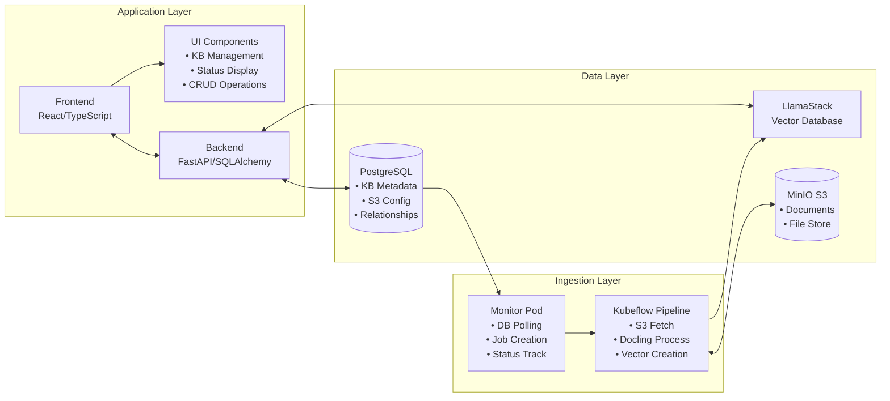
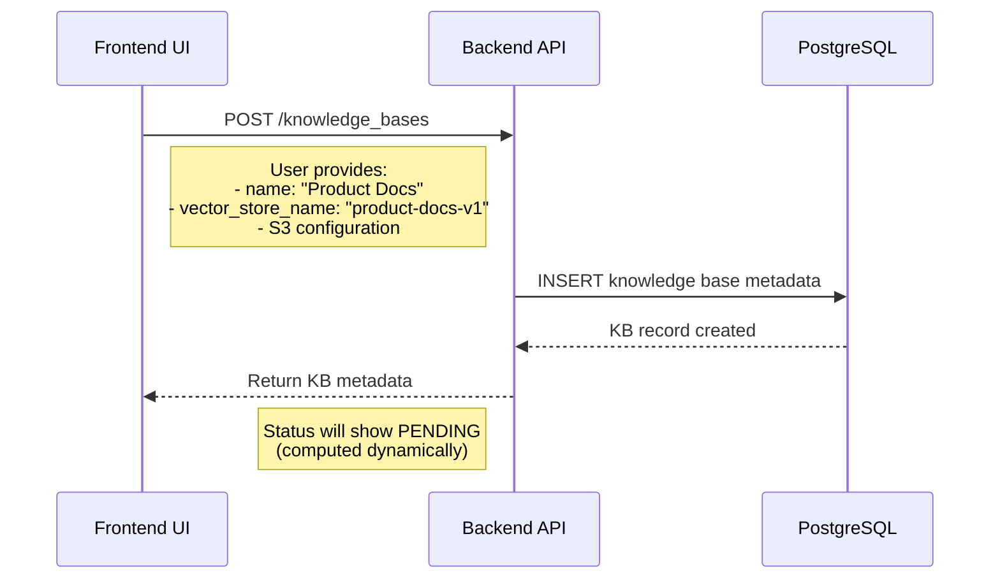
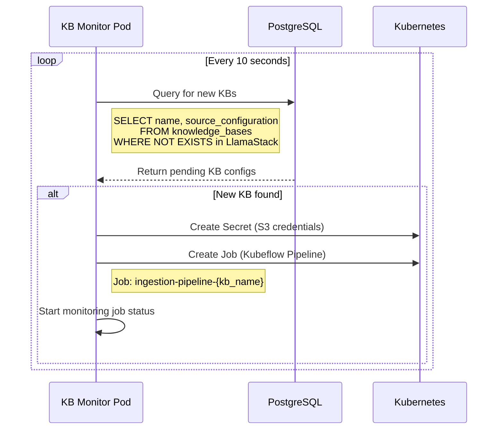
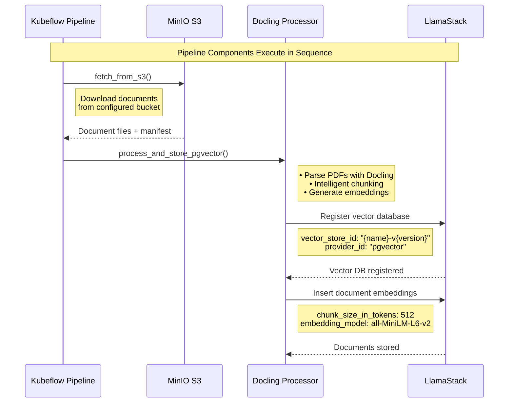
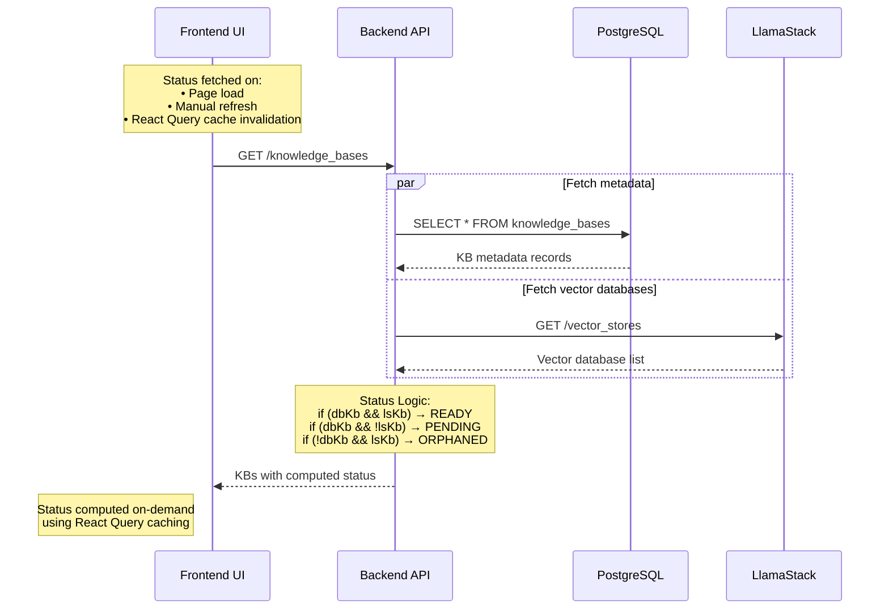
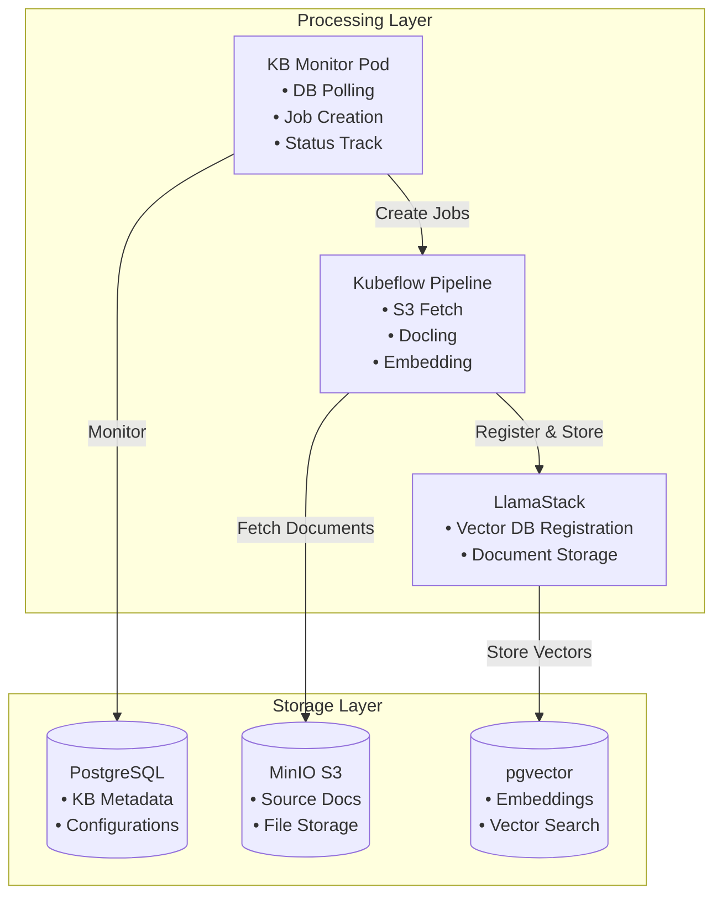

<!-- omit from toc -->
# Knowledge Base Architecture Guide

<!-- omit from toc -->
## Table of Contents
- [Overview](#overview)
- [System Architecture](#system-architecture)
- [Data Flow](#data-flow)
  - [Knowledge Base Creation Flow](#knowledge-base-creation-flow)
  - [Status Determination Logic](#status-determination-logic)
  - [Frontend Implementation Details](#frontend-implementation-details)
  - [Ingestion Process (Kubernetes + Kubeflow Pipelines)](#ingestion-process-kubernetes--kubeflow-pipelines)
  - [Data Synchronization](#data-synchronization)
- [API Endpoints](#api-endpoints)
  - [Backend Knowledge Base Routes (`/backend/routes/knowledge_bases.py`)](#backend-knowledge-base-routes-backendroutesknowledge_basespy)
  - [LlamaStack Integration Routes (`/backend/routes/llama_stack.py`)](#llamastack-integration-routes-backendroutesllama_stackpy)
- [Frontend Implementation](#frontend-implementation)
  - [Service Layer (`/frontend/src/services/knowledge-bases.ts`)](#service-layer-frontendsrcservicesknowledge-basests)
  - [Status Utilities (`/frontend/src/utils/knowledge-base-status.ts`)](#status-utilities-frontendsrcutilsknowledge-base-statusts)
- [Integration Points](#integration-points)
  - [Database ↔ LlamaStack Synchronization](#database--llamastack-synchronization)
  - [Frontend ↔ Backend Communication](#frontend--backend-communication)
  - [Knowledge Base Usage in Virtual Agents](#knowledge-base-usage-in-virtual-agents)
- [Developer Guide](#developer-guide)
  - [Key Implementation Files](#key-implementation-files)
  - [Configuration Patterns](#configuration-patterns)
  - [Development Workflow](#development-workflow)
  - [Troubleshooting](#troubleshooting)

## Overview

This guide explains how knowledge bases work in the AI Virtual Agent Quickstart application, covering the complete data flow from creation to deletion, the integration between frontend and backend systems, and the relationship with LlamaStack for vector database management.

## System Architecture



## Data Flow

### Knowledge Base Creation Flow

The complete knowledge base lifecycle consists of four distinct phases, each with its own workflow:
<!-- omit from toc -->
#### Phase 1: Metadata Creation (User-Initiated)


<!-- omit from toc -->
#### Phase 2: Ingestion Detection (Automated)


<!-- omit from toc -->
#### Phase 3: Document Processing (Kubeflow Pipeline)


<!-- omit from toc -->
#### Phase 4: Status Detection (On-Demand)



### Status Determination Logic

**Important**: Status is NOT stored in the database. It's dynamically computed by comparing database records with LlamaStack vector databases.

The system uses a **dual-state approach** to determine knowledge base status on-demand:

```typescript
// Frontend status inference logic
function determineStatus(dbKb: DatabaseKB | null, lsKb: LlamaStackKB | null): KBStatus {
  if (dbKb && lsKb) return 'READY';     // Exists in both systems
  if (dbKb && !lsKb) return 'PENDING';  // DB only (awaiting ingestion)
  if (!dbKb && lsKb) return 'ORPHANED'; // LlamaStack only (sync issue)
  return 'UNKNOWN';
}
```

**Status Types (Computed Dynamically):**
- **READY**: KB metadata exists in database AND vector database exists in LlamaStack
- **PENDING**: KB metadata exists in database BUT no corresponding vector database in LlamaStack (ingestion not yet completed)
- **ORPHANED**: Vector database exists in LlamaStack BUT no metadata in database (sync issue or manual creation)

### Frontend Implementation Details

**Data Fetching Strategy:**
The frontend uses React Query for data management, NOT continuous polling:

```typescript
// KnowledgeBaseList component uses React Query
const { data: knowledgeBases, isLoading, error } = useQuery({
  queryKey: ['knowledgeBases'],
  queryFn: fetchKnowledgeBasesWithStatus,
  // No polling interval - data fetched on-demand
});
```

**When Status is Fetched:**
- **Page Load**: Initial data fetch when component mounts
- **Manual Refresh**: User clicks "Refresh" button
- **Cache Invalidation**: React Query automatically refetches based on its caching strategy
- **Background Refocus**: React Query may refetch when user returns to the tab (configurable)

**Status Computation Process:**
1. Frontend calls `fetchKnowledgeBasesWithStatus()`
2. Backend makes parallel requests to PostgreSQL and LlamaStack
3. Backend merges data using `mergeKnowledgeBasesWithStatus()` function
4. Status computed dynamically based on presence in both systems
5. React Query caches result until next invalidation

**Key Benefits:**
- **Performance**: Avoids unnecessary API calls through intelligent caching
- **User Control**: Manual refresh gives users control over when to check for updates
- **Resource Efficiency**: No background polling consuming resources
- **Fresh Data**: React Query ensures data freshness when needed

### Ingestion Process (Kubernetes + Kubeflow Pipelines)

**Important**: The frontend and backend do NOT directly handle document ingestion. This is handled by a dedicated Kubernetes-based ingestion system.

**Ingestion Architecture:**


**Ingestion Components:**

1. **Monitor Deployment** (`/ingestion/resources.yaml`)
   - **DB Query Container**: Polls PostgreSQL for new knowledge bases
   - **Monitor Container**: Creates and tracks Kubeflow Pipeline jobs
   - **Auto-scaling**: Runs continuously in Kubernetes cluster

2. **Kubeflow Pipeline** (`/ingestion/ingestion.py`)
   - **S3 Fetch Component**: Downloads documents from MinIO storage
   - **Processing Component**: Uses Docling for document parsing and chunking
   - **Vector Storage Component**: Creates embeddings and stores in LlamaStack

**Detailed Ingestion Flow:**

1. **Knowledge Base Detection**
   ```python
   # Monitor polls database for new KBs
   query = """
       SELECT name, source_configuration::text
       FROM knowledge_bases
       WHERE NOT EXISTS (
           SELECT 1 FROM llamastack_vector_stores
           WHERE kb_name = knowledge_bases.vector_store_name
       );
   """
   ```

2. **Pipeline Job Creation**
   - Monitor creates Kubernetes Job for each new KB
   - Job runs Kubeflow Pipeline with specific configuration
   - Pipeline components execute in isolated containers

3. **Document Processing Pipeline**
   ```python
   # S3 Fetch Component
   def fetch_from_s3(output_dir):
       # Download from MinIO using boto3
       # Create file manifest for next component

   # Processing Component
   def process_and_store_pgvector(input_dir):
       # Use Docling for document conversion
       # HybridChunker for intelligent chunking
       # Generate embeddings and store in LlamaStack
   ```

4. **Vector Database Creation**
   ```python
   # Register vector database with LlamaStack
   client.vector_stores.register(
       vector_store_id=f"{name}-v{version}",
       embedding_model="all-MiniLM-L6-v2",
       provider_id="pgvector"
   )

   # Insert chunked documents with embeddings
   client.tool_runtime.rag_tool.insert(
       documents=llama_documents,
       vector_store_id=vector_store_name,
       chunk_size_in_tokens=512
   )
   ```

**Key Technologies:**
- **Kubeflow Pipelines**: Orchestrates multi-step ingestion workflow
- **Docling**: Advanced document parsing (PDF, HTML, DOCX, Markdown)
- **HybridChunker**: Intelligent text chunking for optimal retrieval
- **MinIO**: S3-compatible object storage for source documents
- **pgvector**: PostgreSQL extension for vector similarity search

### Data Synchronization

The system maintains consistency between three data sources:
<!-- omit from toc -->
#### Database Schema (PostgreSQL)
```sql
-- Backend: models.py - Only stores metadata, NO status field
class KnowledgeBase(Base):
    vector_store_name: str (Primary Key, LlamaStack identifier)
    name: str (Display name)
    version: str
    embedding_model: str
    provider_id: str
    is_external: bool
    source: str
    source_configuration: dict
    created_by: UUID
    created_at: datetime
    updated_at: datetime
    -- NOTE: No status field - status is computed dynamically!
```
<!-- omit from toc -->
#### LlamaStack Vector Database
```python
# LlamaStack vector_store structure
{
    "kb_name": str,              # Matches vector_store_name in DB
    "provider_resource_id": str,
    "description": str,
    "configuration": dict
}
```
<!-- omit from toc -->
#### Frontend State Management
```typescript
// Frontend types - status is computed, not stored
interface KnowledgeBase {
  vector_store_name: string;  // Primary key
  name: string;
  version: string;
  embedding_model: string;
  provider_id: string;
  is_external: boolean;
  source: string;
  source_configuration: object;
  created_at: string;
  updated_at: string;

  // Computed field - NOT from database
  status: 'READY' | 'PENDING' | 'ORPHANED'; // Determined by frontend logic
}
```

## API Endpoints

### Backend Knowledge Base Routes (`/backend/routes/knowledge_bases.py`)

| Method | Endpoint | Description | Integration |
|--------|----------|-------------|-------------|
| `POST` | `/api/knowledge_bases` | Create new KB metadata | Stores in DB only |
| `GET` | `/api/knowledge_bases` | List all KBs from database | DB query |
| `GET` | `/api/knowledge_bases/{id}` | Get specific KB details | DB query |
| `DELETE` | `/api/knowledge_bases/{id}` | Delete KB completely | DB + LlamaStack cleanup |
| `POST` | `/api/knowledge_bases/sync` | Sync with LlamaStack | Bidirectional sync |

### LlamaStack Integration Routes (`/backend/routes/llama_stack.py`)

| Method | Endpoint | Description | Purpose |
|--------|----------|-------------|---------|
| `GET` | `/api/llama_stack/knowledge_bases` | List LlamaStack vector DBs | Status determination |
| `GET` | `/api/llama_stack/models` | List available LLMs | Model selection |

## Frontend Implementation

### Service Layer (`/frontend/src/services/knowledge-bases.ts`)

```typescript
// Core service functions
export const knowledgeBaseService = {
  // Fetch from database
  fetchKnowledgeBases(): Promise<DatabaseKB[]>

  // Fetch from LlamaStack
  fetchLlamaStackKnowledgeBases(): Promise<LlamaStackKB[]>

  // Combined fetch with status inference
  fetchKnowledgeBasesWithStatus(): Promise<KnowledgeBaseWithStatus[]>

  // CRUD operations
  createKnowledgeBase(data: CreateKBRequest): Promise<DatabaseKB>
  deleteKnowledgeBase(id: string): Promise<void>

  // Sync operations
  syncKnowledgeBases(): Promise<DatabaseKB[]>
}
```

### Status Utilities (`/frontend/src/utils/knowledge-base-status.ts`)

```typescript
// Status-related utilities
export const getStatusColor = (status: KBStatus): string => ({
  'READY': 'text-green-600',
  'PENDING': 'text-yellow-600',
  'ORPHANED': 'text-red-600'
}[status]);

export const getStatusLabel = (status: KBStatus): string => ({
  'READY': 'Ready',
  'PENDING': 'Ingestion Pending',
  'ORPHANED': 'Sync Required'
}[status]);
```

## Integration Points

### Database ↔ LlamaStack Synchronization

**Unidirectional Sync Strategy:**
- **From LlamaStack → Database**: Adds missing vector databases to local DB
- **Manual Cleanup**: PENDING items (DB-only) require explicit deletion

```python
# Backend sync logic (simplified)
async def sync_knowledge_bases(db: AsyncSession):
    # Fetch from both sources
    llamastack_kbs = client.vector_stores.list()
    db_kbs = await db.execute(select(KnowledgeBase)).scalars().all()

    # Add missing LlamaStack items to DB
    for ls_kb in llamastack_kbs:
        if not exists_in_db(ls_kb.kb_name, db_kbs):
            create_db_record(ls_kb)

    # Note: Does NOT remove DB-only items (preserves PENDING status)
```

### Frontend ↔ Backend Communication

**Status Inference on Frontend:**
```typescript
// Frontend combines both data sources and computes status
export const fetchKnowledgeBasesWithStatus = async (): Promise<KnowledgeBaseWithStatus[]> => {
  // Fetch both DB and LlamaStack knowledge bases in parallel
  const [dbKnowledgeBases, llamaStackKnowledgeBases] = await Promise.all([
    fetchKnowledgeBases(),
    fetchLlamaStackKnowledgeBases(),
  ]);

  // Merge and determine status for each
  return mergeKnowledgeBasesWithStatus(dbKnowledgeBases, llamaStackKnowledgeBases);
};
```

### Knowledge Base Usage in Virtual Agents

**Integration with LlamaStack Agents:**
Knowledge bases are used for RAG (Retrieval-Augmented Generation) through the LlamaStack agent system. The process works as follows:

1. **Agent Configuration**: Knowledge bases are attached to virtual agents during agent creation
2. **Built-in RAG Tool**: LlamaStack agents use built-in tools that automatically query attached knowledge bases
3. **Automatic Retrieval**: When users ask questions, the agent automatically searches relevant knowledge bases

```typescript
// Virtual Agent creation with knowledge bases
const virtualAssistant = {
  name: "Product Support Assistant",
  model: "llama3.1-8b",
  knowledge_bases: ["product-docs-v1", "faq-kb-v2"], // KB vector_store_names
  tools: ["builtin::rag"], // Built-in RAG tool enabled
  // ... other agent configuration
};

// No direct KB selection in chat - handled automatically by agent
const chatMessage = {
  message: "How do I install the product?",
  agent_id: "product-support-assistant",
  session_id: "session-123"
  // Knowledge base queries happen automatically via agent's RAG tool
};
```

**How do agents use knowledge bases?:**
- The status of a knowledge base must be **Ready** to be able to be used in a new virtual agent.
- Agents automatically use attached KBs for context when calling their RAG tool.
- All attached KBs are available to the agent to be used for context.

## Developer Guide

### Key Implementation Files

| Component | File Path | Purpose |
|-----------|-----------|---------|
| **Backend API** | `/backend/routes/knowledge_bases.py` | KB CRUD operations |
| **LlamaStack Integration** | `/backend/routes/llama_stack.py` | Vector DB queries |
| **Frontend Service** | `/frontend/src/services/knowledge-bases.ts` | KB API client |
| **Status Logic** | `/frontend/src/utils/knowledge-base-status.ts` | Status computation |
| **Ingestion Monitor** | `/ingestion/resources.yaml` | Kubernetes deployment |
| **Pipeline Definition** | `/ingestion/ingestion.py` | Kubeflow components |

### Configuration Patterns

```python
# S3-based knowledge base
{
  "name": "Support Docs",
  "vector_store_name": "support-docs-v1",
  "source": "s3",
  "source_configuration": {
    "bucket_name": "support-documentation",
    "access_key_id": "minioadmin",
    "secret_access_key": "minioadmin123"
  }
}
```
### Development Workflow

This workflow covers knowledge base-specific development tasks:
<!-- omit from toc -->
#### 1. Verify Prerequisites
```bash
# Check ingestion system status
kubectl get deployment ingestion-pipeline-monitor
kubectl get pods -l app=ingestion-pipeline-monitor

# Verify S3 connectivity (MinIO)
curl -I http://localhost:9000/minio/health/live

# Test S3 credentials
aws --endpoint-url http://localhost:9000 s3 ls s3://test-bucket
```
<!-- omit from toc -->
#### 2. Create Knowledge Base with Documents
```bash
# Upload documents to S3 bucket first
aws --endpoint-url http://localhost:9000 s3 cp docs/ s3://company-docs/ --recursive

# Create KB pointing to S3 source
curl -X POST http://localhost:8081/api/knowledge_bases \
  -H "Content-Type: application/json" \
  -d '{
    "name": "Company Documentation",
    "vector_store_name": "company-docs-v1",
    "source": "s3",
    "source_configuration": {
      "bucket_name": "company-docs",
      "access_key_id": "minioadmin",
      "secret_access_key": "minioadmin123"
    }
  }'
```
<!-- omit from toc -->
#### 3. Monitor Ingestion Process
```bash
# Watch for ingestion job creation (within 10 seconds)
kubectl get jobs -w -l pipelines.kubeflow.org/v2_component=true

# Monitor ingestion progress
kubectl logs -f job/ingestion-pipeline-company-docs-v1

# Check status transition (PENDING → READY)
watch "curl -s http://localhost:8081/api/knowledge_bases | jq '.[] | select(.vector_store_name==\"company-docs-v1\") | .status'"
```
<!-- omit from toc -->
#### 4. Test Knowledge Retrieval
```bash
# Verify KB is available in LlamaStack
curl http://localhost:8081/api/llama_stack/knowledge_bases | jq '.[] | select(.kb_name=="company-docs-v1")'

# Test vector search capability
curl -X POST http://localhost:8081/api/llama_stack/rag \
  -H "Content-Type: application/json" \
  -d '{
    "query": "how to install the software",
    "vector_store_ids": ["company-docs-v1"],
    "top_k": 5
  }'
```
<!-- omit from toc -->
#### 5. Integrate with Virtual Agents
```bash
# Create agent that uses the knowledge base
curl -X POST http://localhost:8081/api/virtual_assistants \
  -H "Content-Type: application/json" \
  -d '{
    "name": "Documentation Assistant",
    "model_name": "llama3.1-8b-instruct",
    "prompt": "You are a helpful assistant with access to company documentation.",
    "tools": [{"toolgroup_id": "builtin::rag"}],
    "knowledge_base_ids": ["company-docs-v1"]
  }'

# Test agent with knowledge-based queries
curl -X POST http://localhost:8081/api/llama_stack/chat \
  -H "Content-Type: application/json" \
  -d '{
    "virtualAssistantId": "<agent-id>",
    "messages": [{"role": "user", "content": "What are the installation requirements?"}]
  }'
```
### Troubleshooting

**If knowledge base stays PENDING forever:**
```bash
# 1. Check ingestion monitor is running
kubectl get pods -l app=ingestion-pipeline-monitor
# 2. Verify monitor detected the KB
kubectl logs deployment/ingestion-pipeline-monitor -c monitor | grep "your-kb-name"
# 3. Check S3 connectivity
aws --endpoint-url http://localhost:9000 s3 ls s3://your-bucket/
# 4. Look for ingestion job creation
kubectl get jobs -l pipelines.kubeflow.org/v2_component=true
```

**If knowledge base shows ORPHANED status:**
```bash
# 1. Run sync to add missing DB records
curl -X POST http://localhost:8081/api/knowledge_bases/sync
# 2. Check if KB exists only in LlamaStack
curl http://localhost:8081/api/llama_stack/knowledge_bases
# 3. Verify database connectivity
curl http://localhost:8081/api/knowledge_bases
```

**If ingestion job fails:**
```bash
# 1. Check job status and logs
kubectl get jobs -l job-name=ingestion-pipeline-{kb-name}
kubectl describe job ingestion-pipeline-{kb-name}
kubectl logs job/ingestion-pipeline-{kb-name}
# 2. Verify S3 credentials and permissions
# 3. Check document formats are supported (PDF, DOCX, HTML, Markdown)
# 4. Ensure bucket and files exist
```

**If agent can't use knowledge base:**
```bash
# 1. Verify KB status is READY (not PENDING)
curl http://localhost:8081/api/knowledge_bases | jq '.[] | select(.vector_store_name=="your-kb")'
# 2. Test vector search directly
curl -X POST http://localhost:8081/api/llama_stack/rag \
  -d '{"query": "test search", "vector_store_ids": ["your-kb"], "top_k": 3}'
# 3. Check agent configuration includes correct KB ID
curl http://localhost:8081/api/virtual_assistants/{agent-id} | jq '.knowledge_base_ids'
```

**If ingestion monitor not detecting new KBs:**
```bash
# 1. Check monitor container logs
kubectl logs deployment/ingestion-pipeline-monitor -c db-query
# 2. Verify database query container can connect
kubectl exec -it deployment/ingestion-pipeline-monitor -c db-query -- psql $DATABASE_URL -c "\dt"
# 3. Check monitor polling frequency (default: 10 seconds)
kubectl describe deployment ingestion-pipeline-monitor
```
