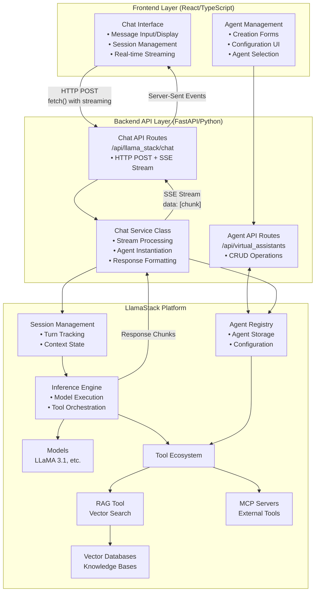
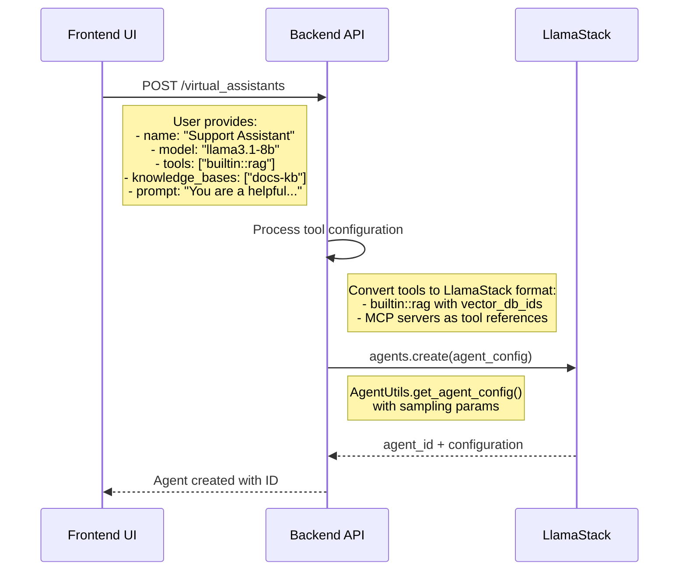
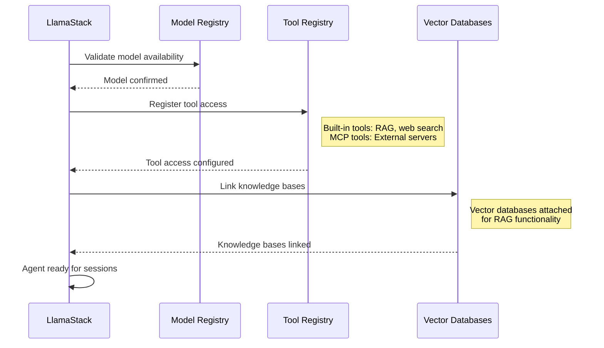
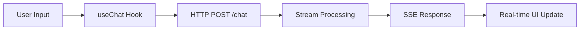
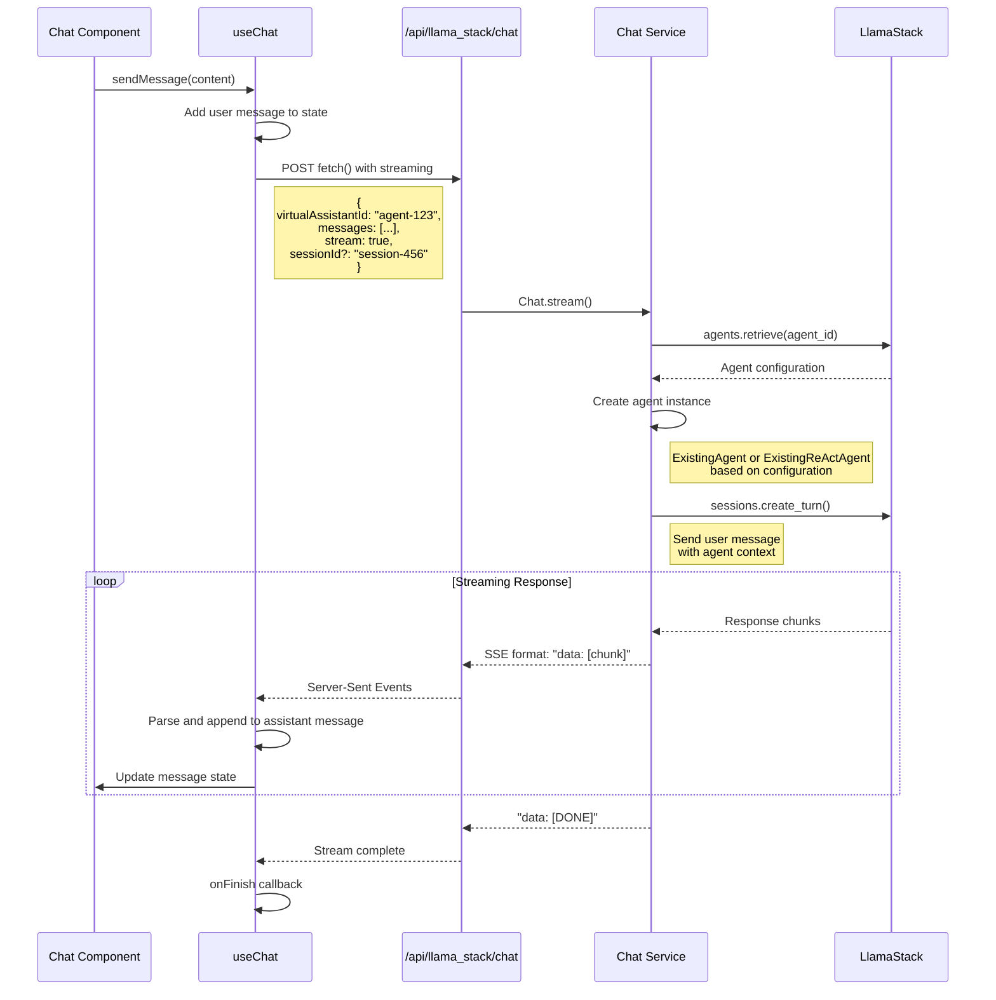

<!-- omit from toc -->
# Virtual Agents Architecture Guide

<!-- omit from toc -->
## Table of Contents
- [Overview](#overview)
- [System Architecture](#system-architecture)
- [Data Flow](#data-flow)
  - [Agent Management Flow (CRUD Operations)](#agent-management-flow-crud-operations)
  - [Chat System](#chat-system)
- [API Endpoints](#api-endpoints)
  - [Backend Virtual Agent Routes (`/backend/routes/virtual_assistants.py`)](#backend-virtual-agent-routes-backendroutesvirtual_assistantspy)
  - [Chat Integration Routes (`/backend/routes/chat.py`)](#chat-integration-routes-backendrouteschatpy)
- [Frontend Implementation](#frontend-implementation)
  - [Chat Implementation Details](#chat-implementation-details)
  - [Service Layer (`/frontend/src/services/agents.ts`)](#service-layer-frontendsrcservicesagentsts)
  - [Component Structure](#component-structure)
  - [Chat Component Architecture](#chat-component-architecture)
- [Integration Points](#integration-points)
  - [Model Integration](#model-integration)
  - [Tool Integration](#tool-integration-1)
  - [Knowledge Base Integration](#knowledge-base-integration)
- [Developer Guide](#developer-guide)
  - [Key Files](#key-files)
  - [Configuration Patterns](#configuration-patterns)
  - [Development Workflow](#development-workflow)
  - [Troubleshooting](#troubleshooting)

## Overview

This guide explains how virtual agents (AI assistants) work in the AI Virtual Agent Quickstart application, covering the complete data flow from creation to deletion, the integration between frontend and backend systems, and the relationship with LlamaStack for agent management.

## System Architecture



## Data Flow

### Agent Management Flow (CRUD Operations)

The virtual agent lifecycle consists of several phases:
<!-- omit from toc -->
#### Phase 1: Agent Configuration (User-Initiated)


<!-- omit from toc -->
#### Phase 2: Agent Registration (Automatic)


> [!NOTE]
> Agents are stored and managed entirely within LlamaStack. The backend acts as a proxy for configuration and does not maintain local agent state.
<!-- omit from toc -->
#### Agent Configuration Structure
```python
# LlamaStack Agent Configuration
agent_config = {
    "name": "Support Assistant",
    "model": "llama3.1-8b-instruct",
    "instructions": "You are a helpful support assistant...",
    "tools": [
        {
            "name": "builtin::rag",
            "args": {
                "vector_db_ids": ["product-docs-v1", "faq-kb-v2"]
            }
        },
        "mcp-server-tool-id"
    ],
    "sampling_params": {
        "strategy": {"type": "greedy"},
        "max_tokens": 4096,
        "temperature": 0.1
    },
    "input_shields": [],
    "output_shields": [],
    "max_infer_iters": 10
}
```
<!-- omit from toc -->
#### Tool Integration
```python
# Backend tool processing
tools = []
for tool_info in agent.tools:
    if tool_info.toolgroup_id == "builtin::rag":
        if len(agent.knowledge_base_ids) > 0:
            tool_dict = {
                "name": "builtin::rag",
                "args": {
                    "vector_db_ids": list(agent.knowledge_base_ids),
                }
            }
            tools.append(tool_dict)
    else:
        tools.append(tool_info.toolgroup_id)
```

### Chat System
<!-- omit from toc -->
#### Simple Overview

----
<!-- omit from toc -->
#### In-depth Overview


## API Endpoints

### Backend Virtual Agent Routes (`/backend/routes/virtual_assistants.py`)

| Method | Endpoint | Description | Integration |
|--------|----------|-------------|-------------|
| `POST` | `/api/virtual_assistants` | Create new agent | LlamaStack agents.create() |
| `GET` | `/api/virtual_assistants` | List all agents | LlamaStack agents.list() |
| `GET` | `/api/virtual_assistants/{id}` | Get specific agent | LlamaStack agents.retrieve() |
| `DELETE` | `/api/virtual_assistants/{id}` | Delete agent | LlamaStack agents.delete() |

### Chat Integration Routes (`/backend/routes/chat.py`)

| Method | Endpoint | Description | Purpose |
|--------|----------|-------------|---------|
| `POST` | `/api/llama_stack/chat` | Start chat session | Agent conversation |
| `GET` | `/api/llama_stack/sessions/{id}/turns` | Get chat history | Session management |

## Frontend Implementation

### Chat Implementation Details

The frontend chat system uses a custom React hook with HTTP fetch and Server-Sent Events for real-time streaming:

```typescript
// useChat hook flow
export function useChat(agentId: string, options?: UseLlamaChatOptions) {
  const sendMessage = useCallback(async (content: string) => {
    // 1. Add user message to state immediately
    const userMessage: ChatMessage = {
      id: `user-${Date.now()}`,
      role: 'user',
      content: content.trim(),
      timestamp: new Date(),
    };
    setMessages(prev => [...prev, userMessage]);

    // 2. Prepare HTTP request body
    const requestBody = {
      virtualAssistantId: agentId,
      messages: [...messages, userMessage].map(msg => ({
        role: msg.role,
        content: msg.content,
      })),
      stream: true,
      ...(sessionId ? { sessionId } : {}),
    };

    // 3. Send HTTP POST with fetch (NOT WebSocket)
    const response = await fetch(CHAT_API_ENDPOINT, {
      method: 'POST',
      headers: { 'Content-Type': 'application/json' },
      body: JSON.stringify(requestBody),
    });

    // 4. Process Server-Sent Events stream
    const reader = response.body.getReader();
    const decoder = new TextDecoder();

    while (true) {
      const { done, value } = await reader.read();
      if (done) break;

      // Parse SSE data: [chunk] format
      const lines = buffer.split('\n');
      for (const line of lines) {
        if (line.startsWith('data: ')) {
          const data = line.slice(6).trim();
          if (data === '[DONE]') continue;

          // Update assistant message content incrementally
          const parsed = LlamaStackParser.parse(data);
          if (parsed) {
            setMessages(prev => {
              const updated = [...prev];
              const lastMsg = updated[updated.length - 1];
              if (lastMsg?.role === 'assistant') {
                lastMsg.content += parsed;
              }
              return updated;
            });
          }
        }
      }
    }
  }, [agentId, messages, sessionId]);
}
```

### Service Layer (`/frontend/src/services/agents.ts`)

```typescript
// Core agent service functions
export const agentService = {
  // Fetch all agents
  fetchAgents(): Promise<Agent[]>

  // CRUD operations
  createAgent(data: NewAgent): Promise<Agent>
  deleteAgent(id: string): Promise<void>
}
```

### Component Structure
```
components/
├── chat.tsx                # Main chat interface with PatternFly Chatbot
├── agent-form.tsx          # Agent creation form
├── agent-card.tsx          # Individual agent display
├── agent-list.tsx          # List of all agents
├── new-agent-card.tsx      # New agent creation card
└── multi-select.tsx        # Tool/KB selection component

hooks/
└── useChat.ts               # Custom chat hook (HTTP + SSE)

services/
├── agents.ts               # Agent CRUD operations
└── chat-sessions.ts        # Session management

config/
└── api.ts                  # API endpoint configuration
```

### Chat Component Architecture
```typescript
// Chat component uses PatternFly Chatbot with custom hook
export function Chat() {
  const {
    messages,
    sendMessage,
    isLoading,
    loadSession
  } = useChat(selectedAgent);

  // Convert to PatternFly message format
  const patternflyMessages = useMemo(() =>
    messages.map(msg => ({
      id: msg.id,
      role: msg.role,
      content: msg.content,
      timestamp: msg.timestamp.toLocaleString(),
      avatar: msg.role === 'user' ? userAvatar : botAvatar,
      isLoading: msg.role === 'assistant' && isLoading &&
                 msg.id === messages[messages.length - 1]?.id,
    }))
  );

  return (
    <Chatbot displayMode={ChatbotDisplayMode.embedded}>
      <ChatbotContent>
        <MessageBox messages={patternflyMessages} />
      </ChatbotContent>
      <ChatbotFooter>
        <MessageBar onSendMessage={sendMessage} />
      </ChatbotFooter>
    </Chatbot>
  );
}
```

## Integration Points

### Model Integration

**Available Models:**
```typescript
// Models fetched from LlamaStack
interface Model {
  model_name: string;
  provider_resource_id: string;
  model_type: string;
}

// Popular models
const models = [
  "llama3.1-8b-instruct",
  "llama3.1-70b-instruct",
  "llama3.2-1b-instruct"
];
```

### Tool Integration

**Built-in Tools:**
- `builtin::rag` - Retrieval-Augmented Generation
- `builtin::web_search` - Web search capabilities

**MCP Server Tools:**
```typescript
interface ToolGroup {
  toolgroup_id: string;
  name: string;
  description?: string;
  endpoint_url?: string;
}
```

### Knowledge Base Integration

**RAG Configuration:**
```python
# When RAG tool is selected
if tool_info.toolgroup_id == "builtin::rag":
    if len(agent.knowledge_base_ids) > 0:
        tool_dict = {
            "name": "builtin::rag",
            "args": {
                "vector_db_ids": list(agent.knowledge_base_ids),
            }
        }
```

**Knowledge Base Lifecycle Integration:**
- **READY Knowledge Bases**: Available for agent attachment
- **Automatic Discovery**: Agents query attached KBs during RAG operations
- **Dynamic Updates**: Agent tool configuration updates when KBs change status

## Developer Guide

### Key Files

| Component | File Path | Purpose |
|-----------|-----------|---------|
| **Backend API** | `/backend/routes/virtual_assistants.py` | Agent CRUD operations |
| **Chat Service** | `/backend/routes/llama_stack.py` | Streaming chat with SSE |
| **Frontend Service** | `/frontend/src/services/agents.ts` | Agent API client |
| **Chat Hook** | `/frontend/src/hooks/useChat.ts` | Real-time chat logic |
| **Agent Form** | `/frontend/src/components/agent-form.tsx` | Agent creation UI |

### Configuration Patterns

```python
# Minimal agent
{
  "name": "Basic Assistant",
  "model_name": "llama3.1-8b-instruct",
  "prompt": "You are a helpful assistant"
}

# Knowledge-enhanced agent
{
  "name": "Knowledge Assistant",
  "model_name": "llama3.1-8b-instruct",
  "prompt": "You are a knowledgeable assistant with access to documentation.",
  "tools": [{"toolgroup_id": "builtin::rag"}],
  "knowledge_base_ids": ["docs-kb"]
}
```

### Development Workflow

This workflow covers the virtual agent-specific development tasks:
<!-- omit from toc -->
#### 1. Verify Prerequisites
```bash
# Check available knowledge bases (must be READY for RAG agents)
curl http://localhost:8081/api/knowledge_bases | jq '.[] | select(.status=="READY")'

# Check available models
curl http://localhost:8081/api/llama_stack/llms | jq '.[].model_name'

# Check available tools
curl http://localhost:8081/api/llama_stack/mcp_servers
```
<!-- omit from toc -->
#### 2. Create Agent with Knowledge Base
```bash
# Create a RAG-enabled support agent
curl -X POST http://localhost:8081/api/virtual_assistants \
  -H "Content-Type: application/json" \
  -d '{
    "name": "Support Agent",
    "model_name": "llama3.1-8b-instruct",
    "prompt": "You are a helpful support agent. Always cite sources when referencing documentation.",
    "tools": [{"toolgroup_id": "builtin::rag"}],
    "knowledge_base_ids": ["support-docs-kb"]
  }'

# Save the returned agent ID for testing
```
<!-- omit from toc -->
#### 3. Test Agent Capabilities
```bash
# Test basic conversation
curl -X POST http://localhost:8081/api/llama_stack/chat \
  -H "Content-Type: application/json" \
  -d '{
    "virtualAssistantId": "<agent-id>",
    "messages": [{"role": "user", "content": "How do I reset my password?"}]
  }'

# Test knowledge retrieval (look for citations in response)
curl -X POST http://localhost:8081/api/llama_stack/chat \
  -H "Content-Type: application/json" \
  -d '{
    "virtualAssistantId": "<agent-id>",
    "messages": [{"role": "user", "content": "What are the system requirements?"}]
  }'
```
<!-- omit from toc -->
#### 4. Frontend Testing
```typescript
// Test the useChat hook with new agent
const { messages, sendMessage, isLoading } = useChat(agentId);

// Verify streaming works
await sendMessage("Tell me about the installation process");

// Check for:
// - Real-time message streaming
// - Knowledge base citations in responses
// - No console errors
// - Proper message formatting
```
<!-- omit from toc -->
#### 5. Agent Iteration
```bash
# Update agent configuration by deleting and recreating
curl -X DELETE http://localhost:8081/api/virtual_assistants/<agent-id>

# Create improved version with refined prompt
curl -X POST http://localhost:8081/api/virtual_assistants \
  -H "Content-Type: application/json" \
  -d '{
    "name": "Support Agent v2",
    "model_name": "llama3.1-8b-instruct",
    "prompt": "You are a friendly support agent specializing in technical issues. Always provide step-by-step solutions and cite relevant documentation.",
    "tools": [{"toolgroup_id": "builtin::rag"}],
    "knowledge_base_ids": ["support-docs-kb", "troubleshooting-kb"]
  }'
```

### Troubleshooting

**If agent doesn't appear in frontend list:**
```bash
# 1. Check LlamaStack connection
curl http://localhost:8081/api/virtual_assistants
# 2. Verify agent creation response had valid ID
# 3. Check backend logs for creation errors
docker logs backend-container | grep "virtual_assistant"
```

**If knowledge base doesn't appear in agent configuration:**
```bash
# 1. Verify KB status is READY
curl http://localhost:8081/api/knowledge_bases | jq '.[] | select(.status=="READY")'
# 2. If PENDING, wait for ingestion to complete
# 3. If missing, check knowledge base architecture guide
```

**If agent creation fails with tool errors:**
```bash
# 1. Validate tool configuration format
curl http://localhost:8081/api/llama_stack/mcp_servers
# 2. Check LlamaStack tool registry
# 3. Verify builtin::rag format matches requirements
```

**If chat messages don't stream properly:**
```bash
# 1. Test chat endpoint directly
curl -X POST http://localhost:8081/api/llama_stack/chat \
  -H "Content-Type: application/json" \
  -d '{"virtualAssistantId": "agent-123", "messages": [{"role": "user", "content": "test"}]}'
# 2. Check browser Network tab for SSE events
# 3. Verify no CORS or network issues
```

**If agent responses lack knowledge base context:**
```bash
# 1. Verify agent has RAG tool configured
curl http://localhost:8081/api/virtual_assistants/{agent-id} | jq '.tools'
# 2. Test knowledge base search directly
curl -X POST http://localhost:8081/api/llama_stack/rag \
  -d '{"query": "test", "vector_db_ids": ["kb-name"]}'
# 3. Check if KB is actually attached to agent
```
